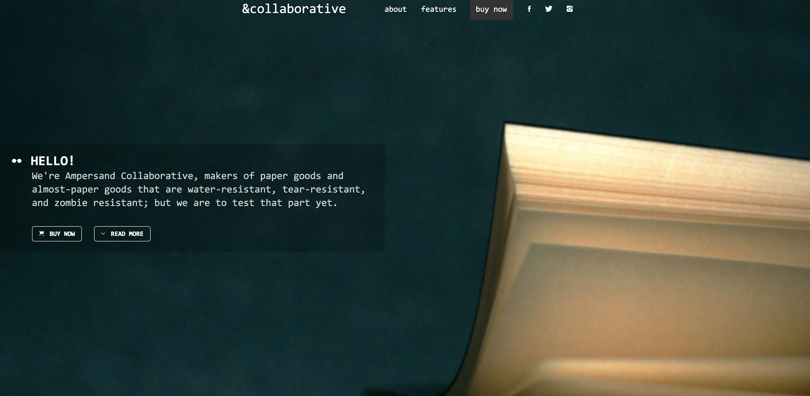
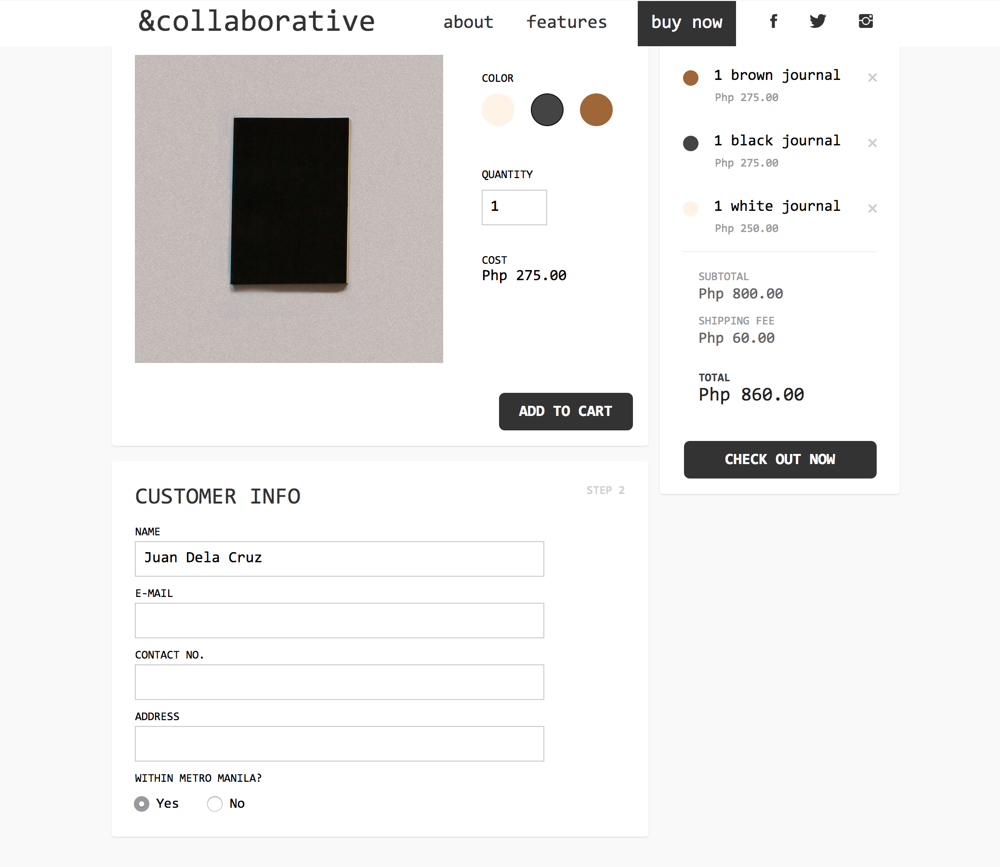
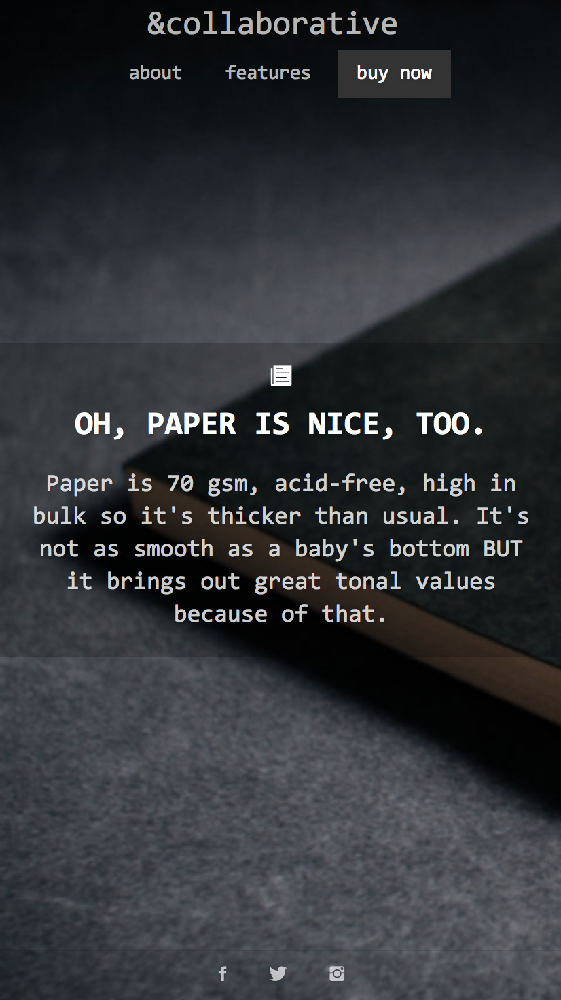
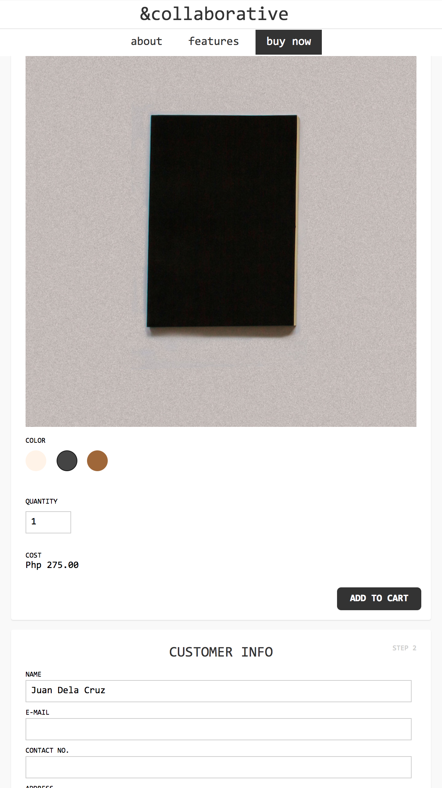

	

<figcaption>
	Full-screen pages direct the user's focus to product photos and features.
</figcaption>

	

	

	

	

<figcaption>
	Order details go to a private Google spreadsheet for further processing.
</figcaption>

	

		
	

	

		
	

<figcaption>
	Responsive layout caters to young, always-on-the-go professionals – the product's primary target market.
</figcaption>
