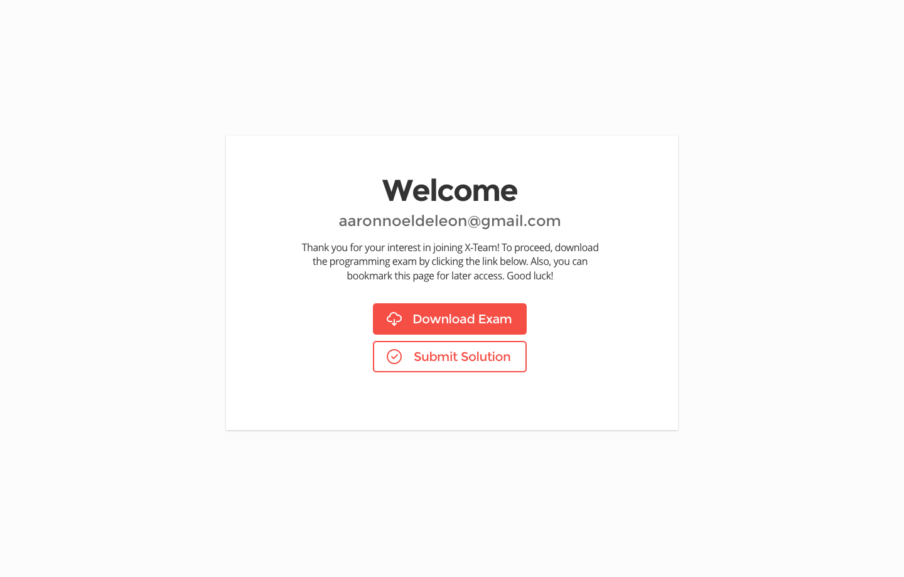
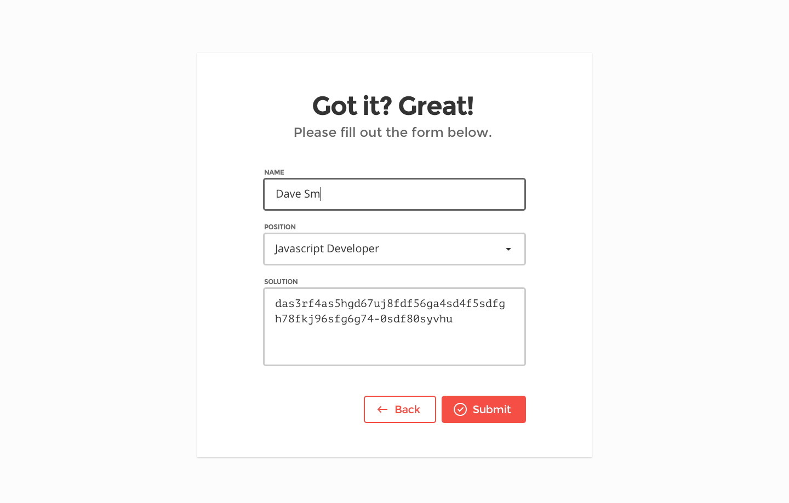
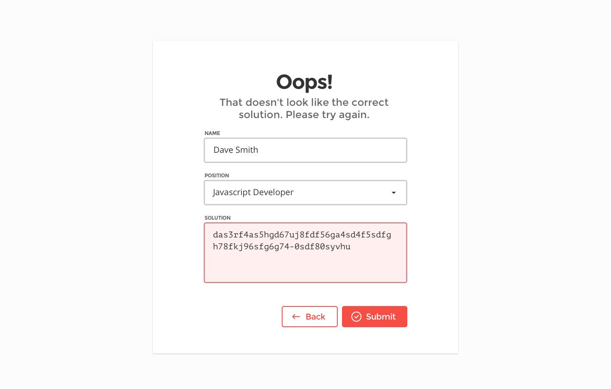
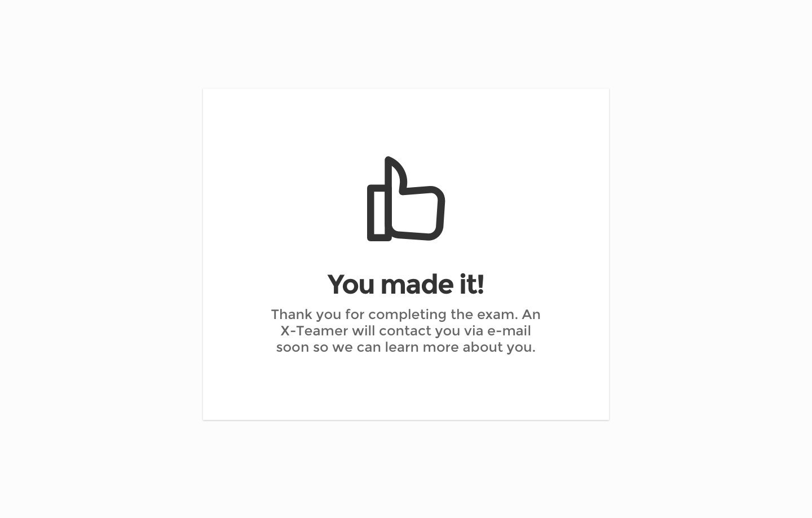

###### The Problem

Having access to the global talent pool, X-Team receives hundreds of applications from aspiring developers per day. The company needs a way to weed out _unserious_ applicants.

	

<figcaption>
	<strong>The Solution:</strong> A simple debugging test that should take at most 10 minutes.
</figcaption>

	

	

	

