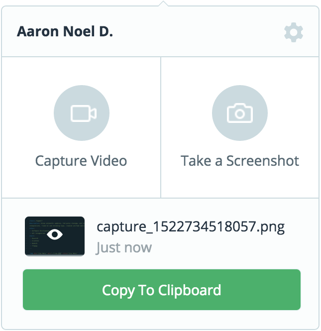
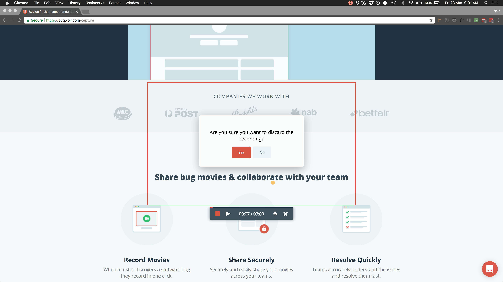
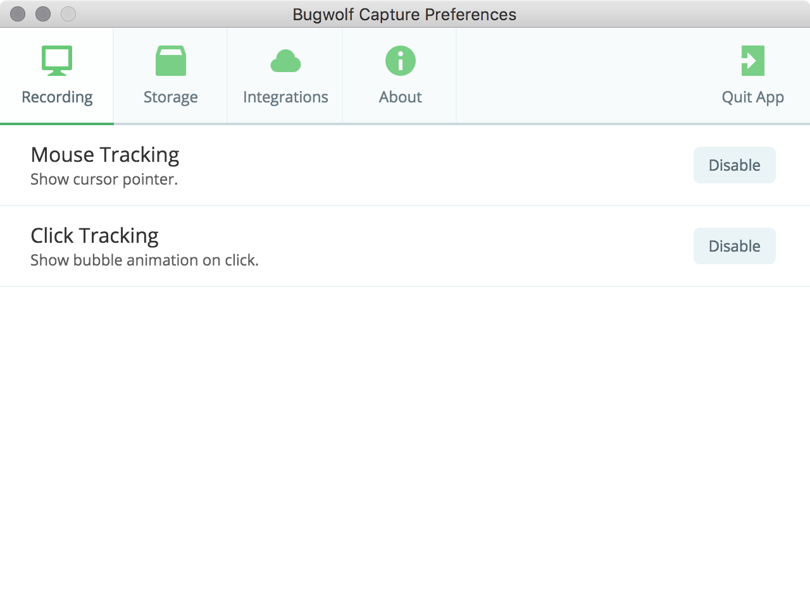
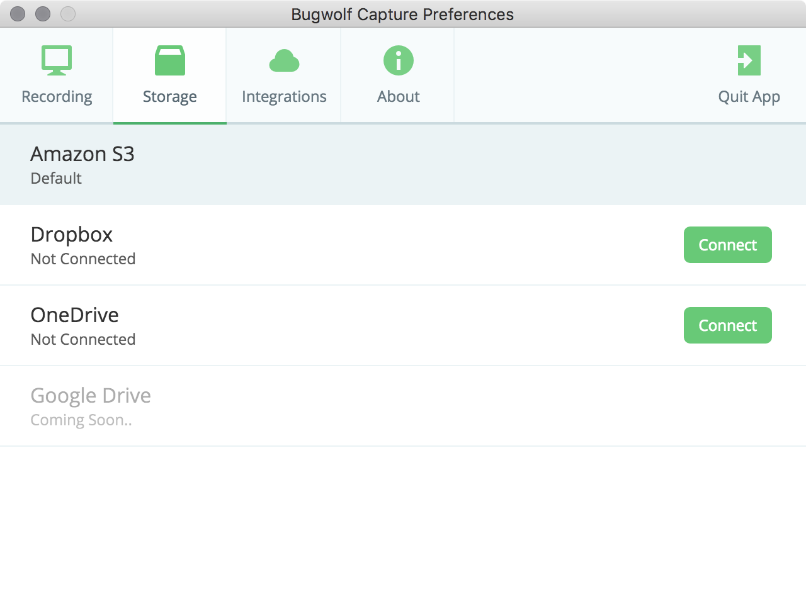
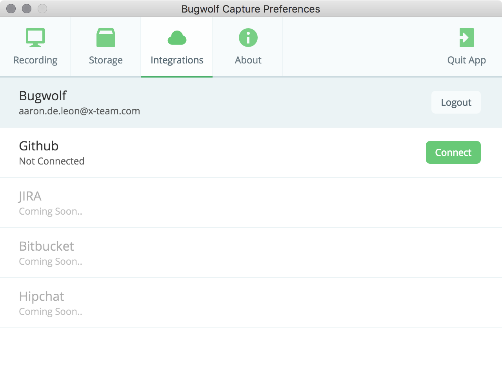

	

		
	

	

		<h6>Overview</h6>
		

			Capture is an Electron-based tray application that allows quick screenshot / screencast sharing.
		

		
It helps users submit better bug reports by providing:

		<ul>
			<li>Cursor / click tracking</li>
			<li>Audio recording</li>
			<li>3rd-party service integrations</li>
		</ul>
	

	

<figcaption>
	<strong>Recording prompt</strong> – showing dynamic tray icon, area selector, and recording controls.
</figcaption>

	

<figcaption>
	<strong>Recording settings</strong> – with cross-platform mouse and click tracking.
</figcaption>

	

<figcaption>
	<strong>Storage options</strong> – allows users to select their preferred cloud storage service.
</figcaption>

	

<figcaption>
	<strong>Issue tracking options</strong> – allows users to connect simultaneously to 3rd-party project management services.
</figcaption>
