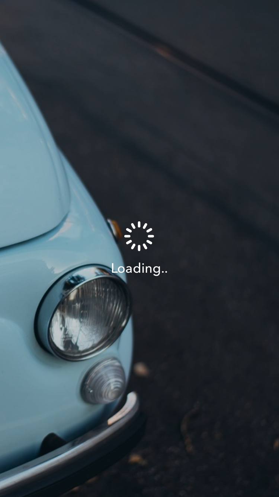
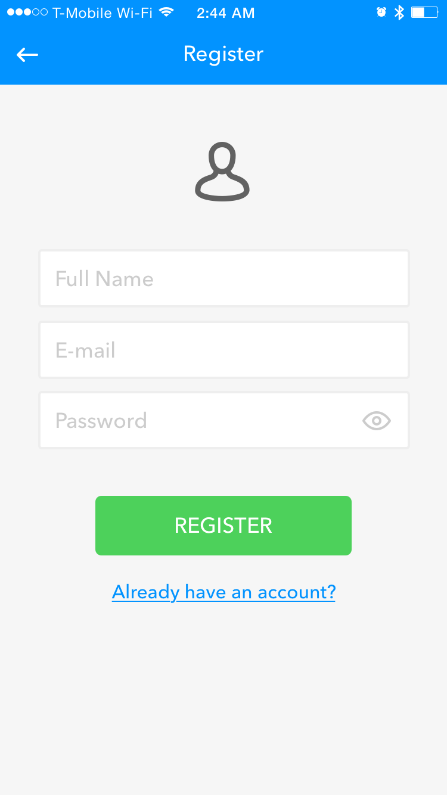
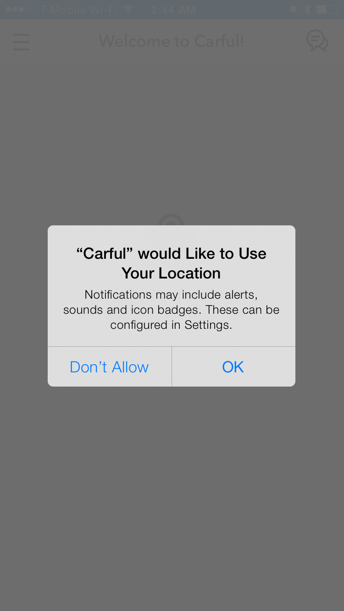
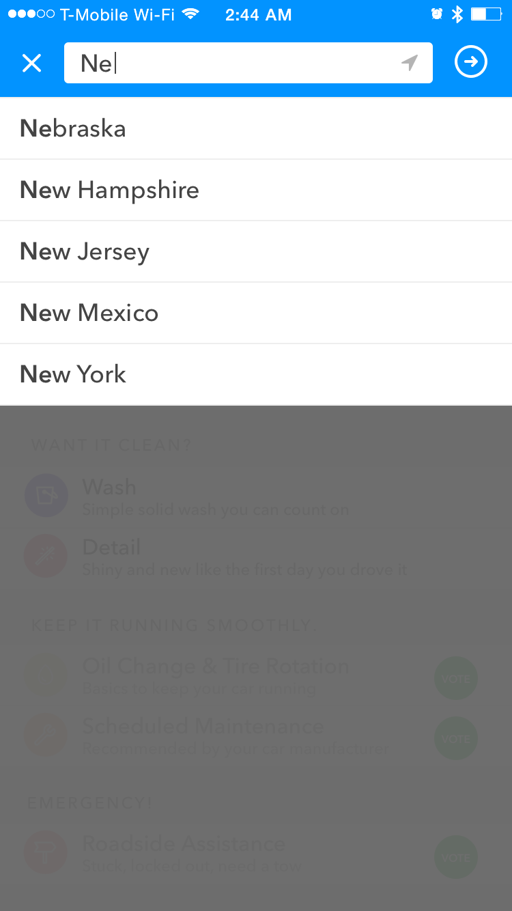
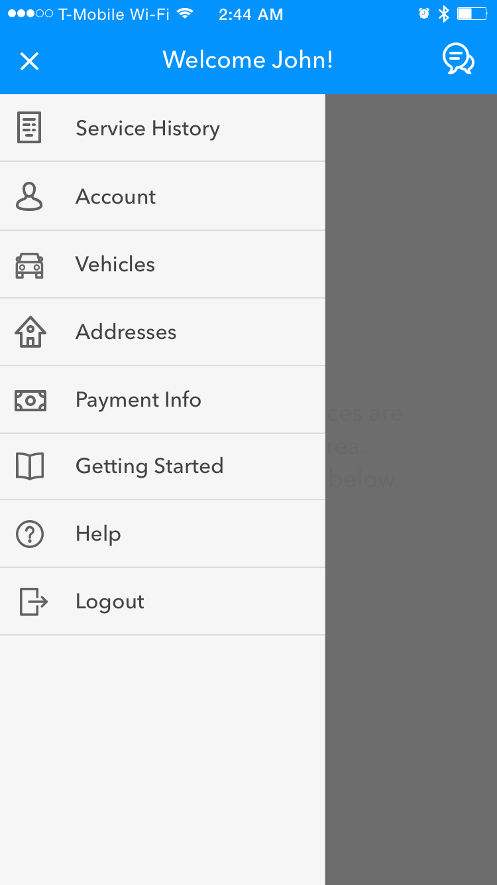
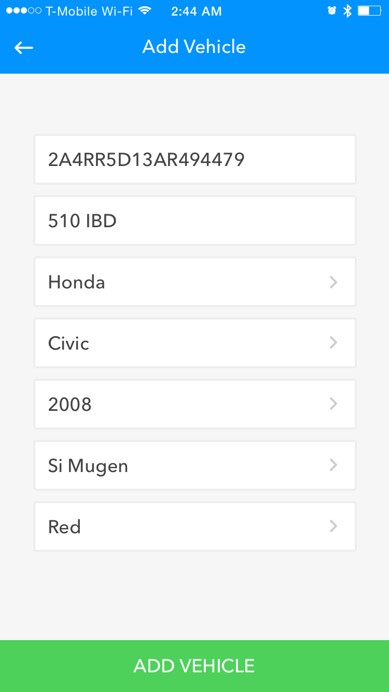
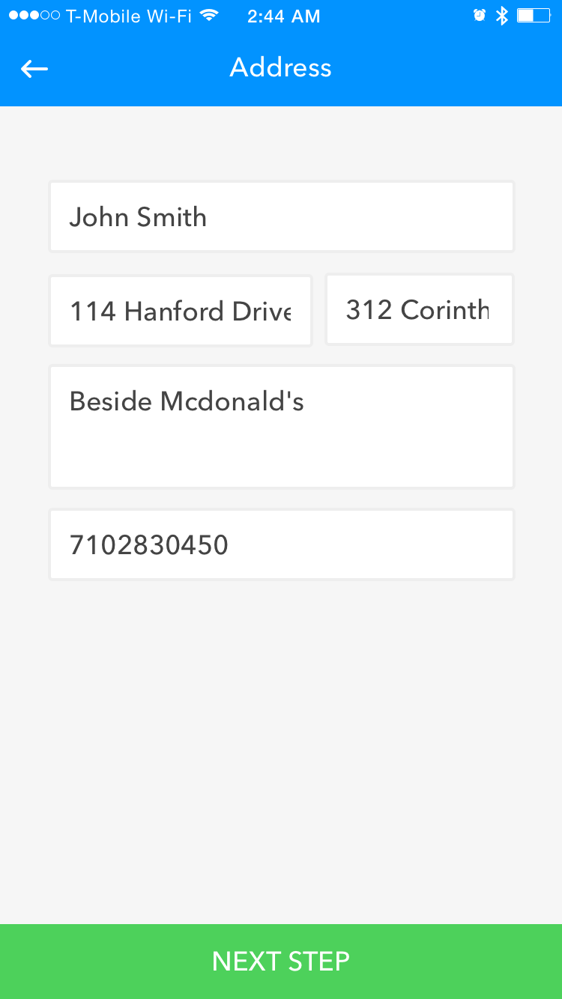
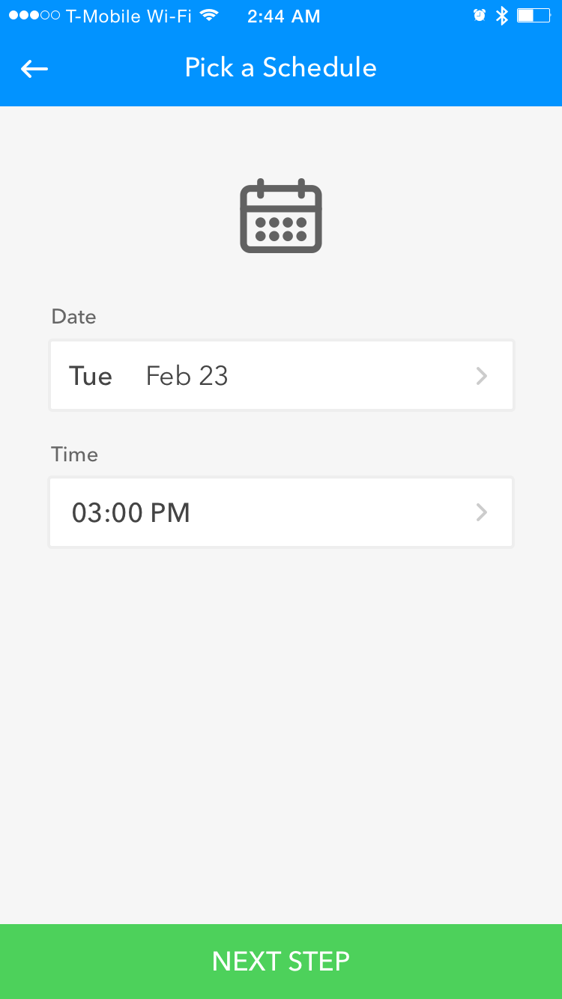
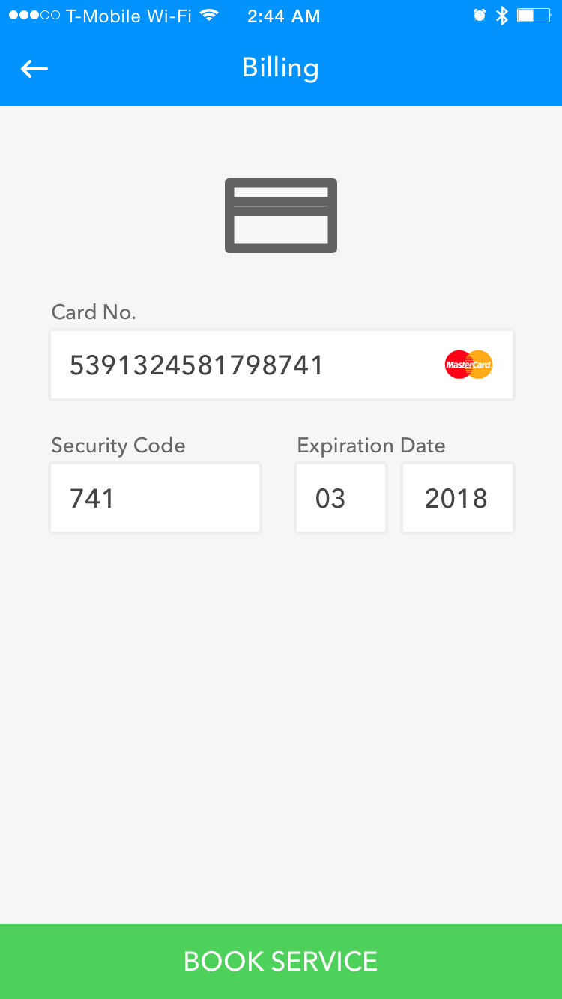

	

		<h6>Overview</h6>
		

			<strong>Carful</strong> is an Android / iOS app that facilitates on-demand auto services.
		

		

			Services are pooled from partnering providers within the area.
		

	

	

		
	

	

		
	

	

		
	

	

		
	

	

		
	

<figcaption>
	Simple, straightforward user onboarding.
</figcaption>

	

		
	

	

		
	

	

		
	

	

		
	

	

		
	

	

		
	

<figcaption>
	Account management and service booking screens.
</figcaption>
