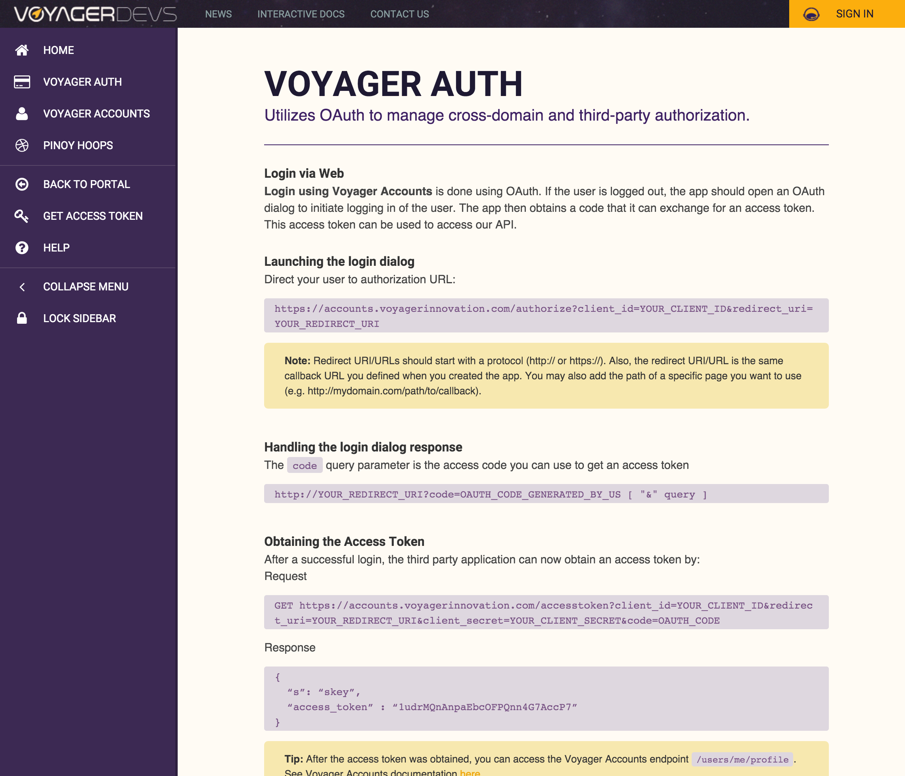
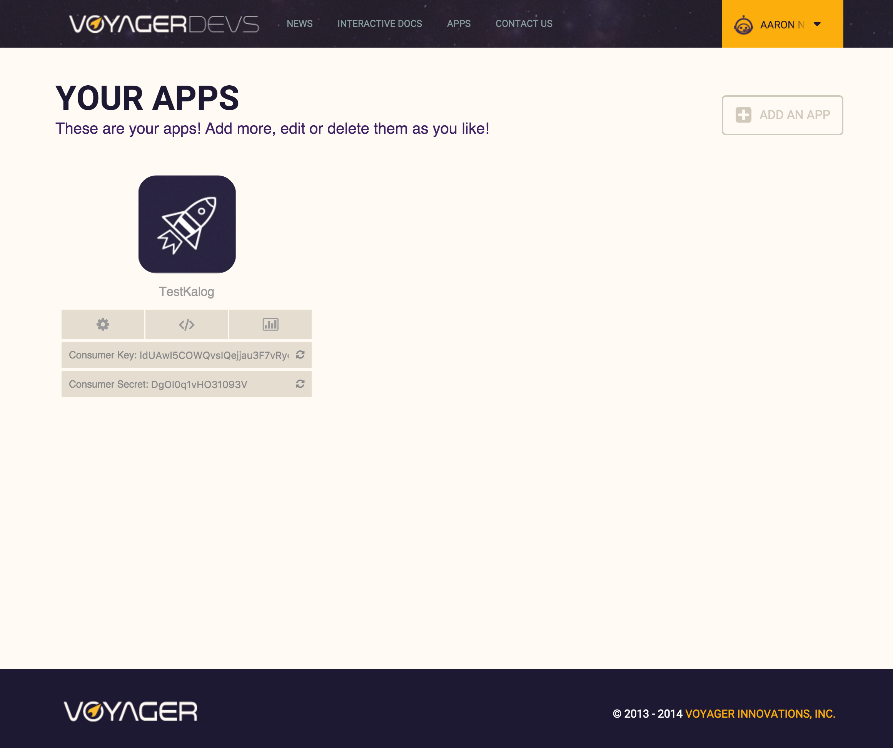

	

<figcaption>
	Voyager Innovation's DevPortal landing page.
</figcaption>

	

<figcaption>
	API Documentation powered by Swagger.
</figcaption>

	

<figcaption>
	API key and access management dashboard.
</figcaption>
