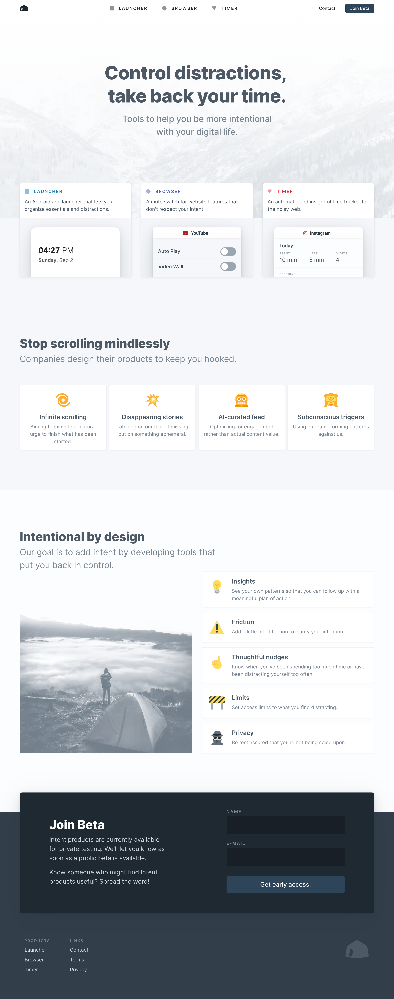
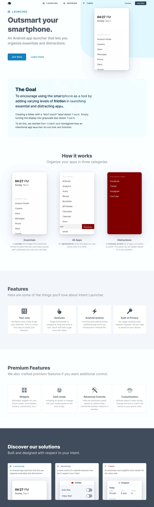
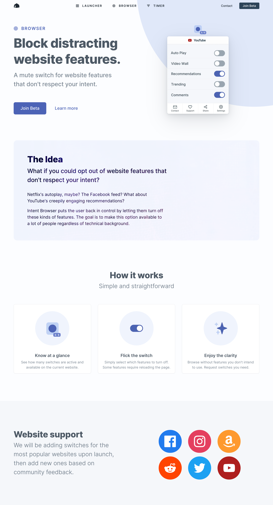
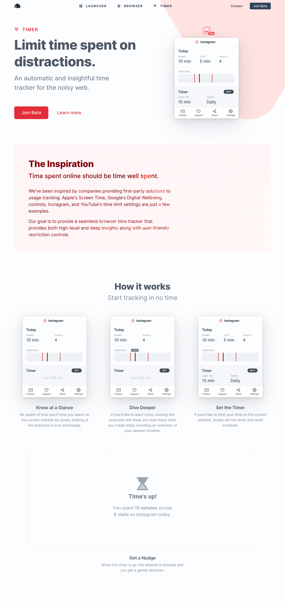
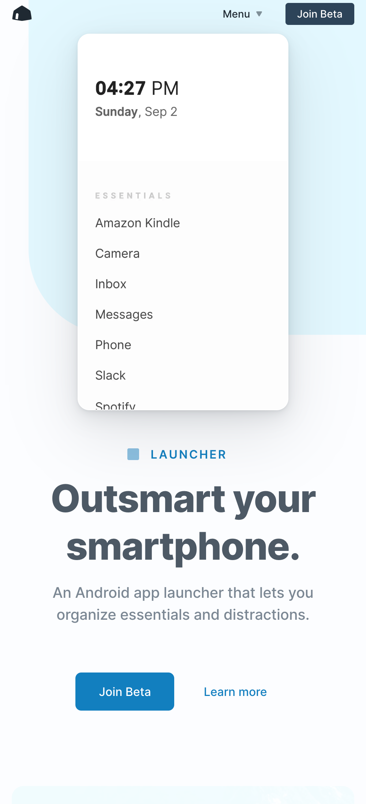
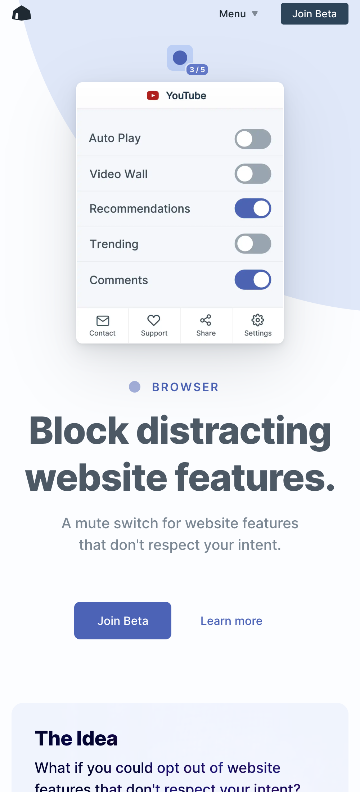
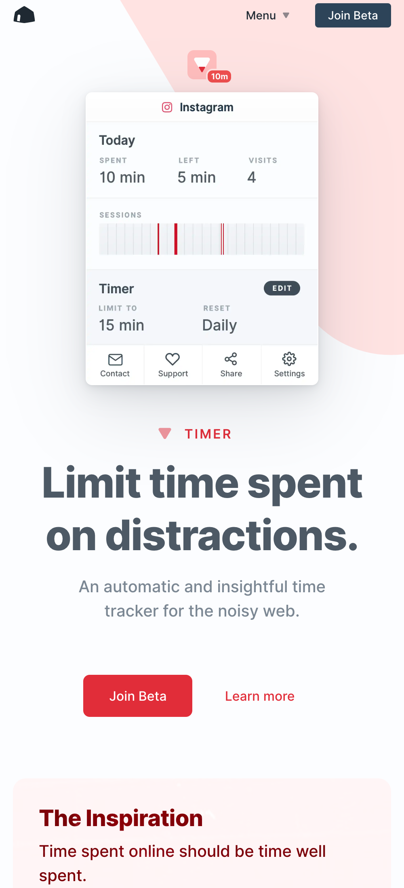

	

<figcaption>
	<strong>Landing Page</strong> – aims to be introduce Intent's mission and the problem it's trying to solve along with the products as solutions.
</figcaption>

	

<figcaption>
	<strong>Launcher</strong> – an Android app launcher that lets you organize essentials and distractions.
</figcaption>

	

<figcaption>
	<strong>Browser</strong> – a mute switch for website features that don't respect your intent.
</figcaption>

	

<figcaption>
	<strong>Timer</strong> – an automatic and insightful time tracker for the noisy web.
</figcaption>

	

		
	

	

		
	

	

		
	

<figcaption>
	<strong>Responsive pages</strong> – Well, of course. 😉
</figcaption>
