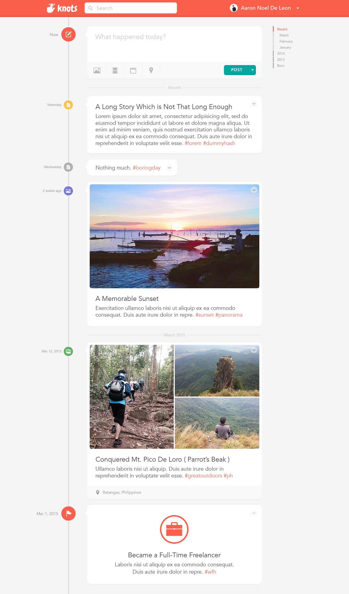
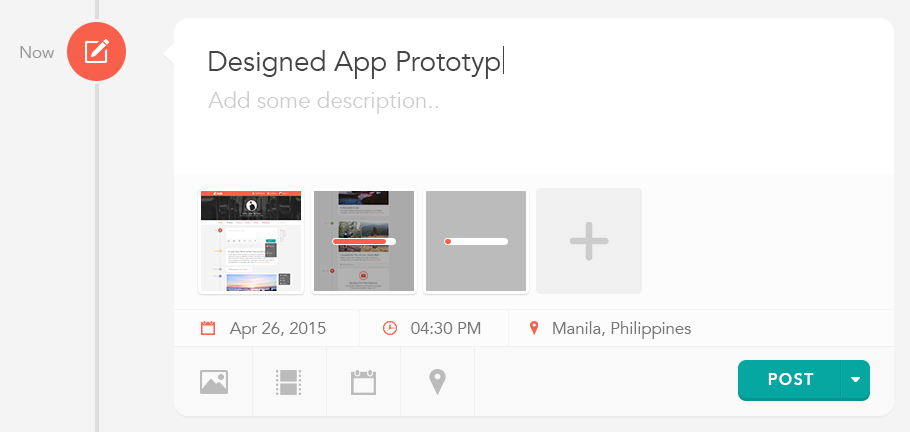
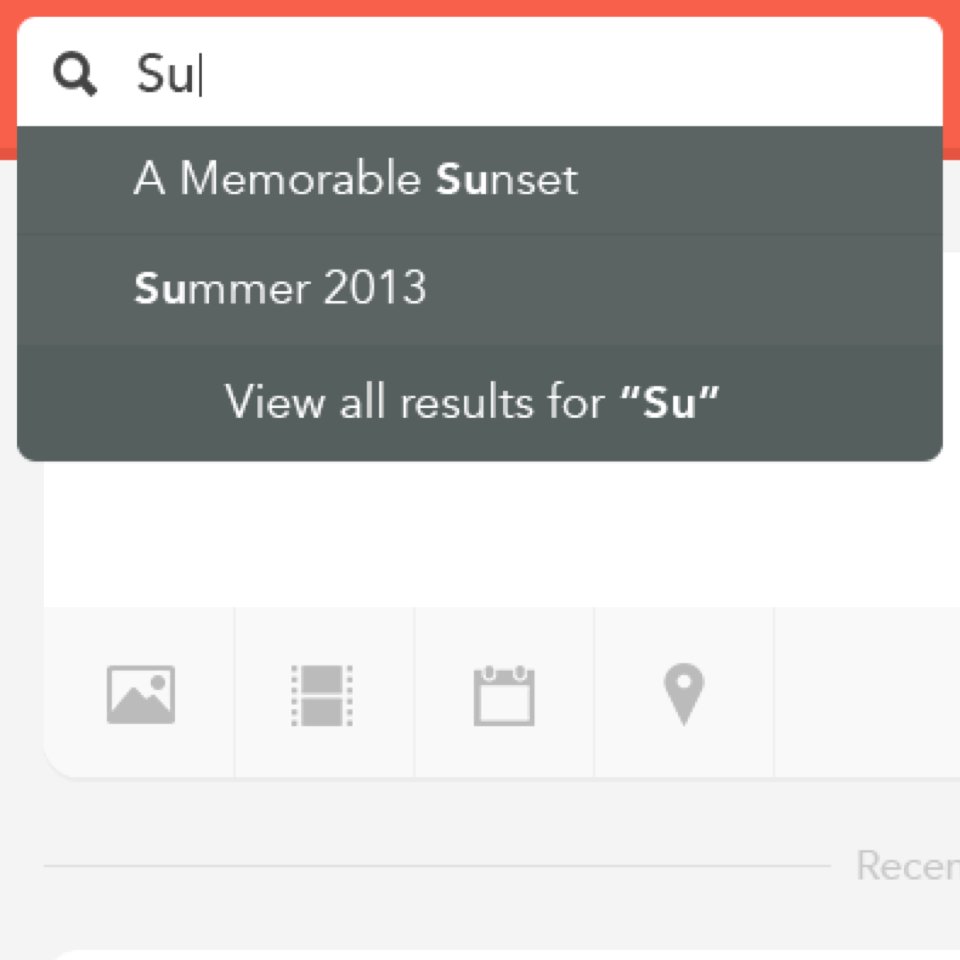
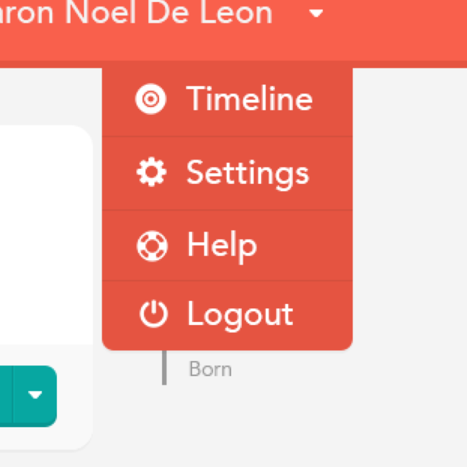
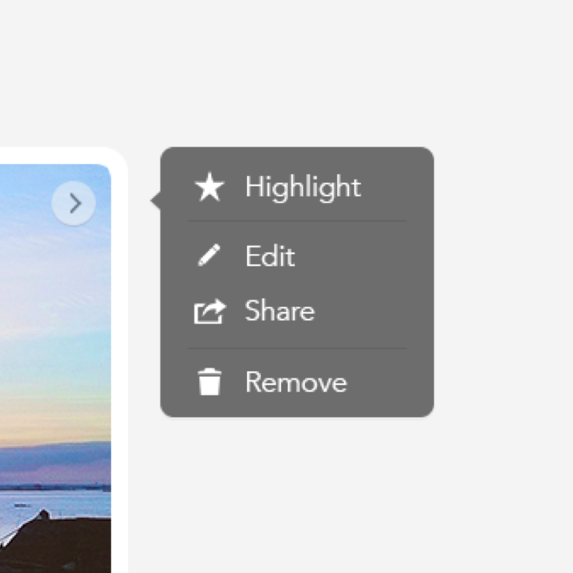

	

<figcaption>
	<strong>Knots</strong> is a simple, private, and personal timeline for all the memories worth remembering.
</figcaption>

	

<figcaption>
	<strong>New Post</strong> – the app allows the user to include as much detail as possible.
</figcaption>

	

		

			
		

		<figcaption>Search</figcaption>
	

	

		

			
		

		<figcaption>User Dropdown</figcaption>
	

	

		

			
		

		<figcaption>Post Options</figcaption>
	

