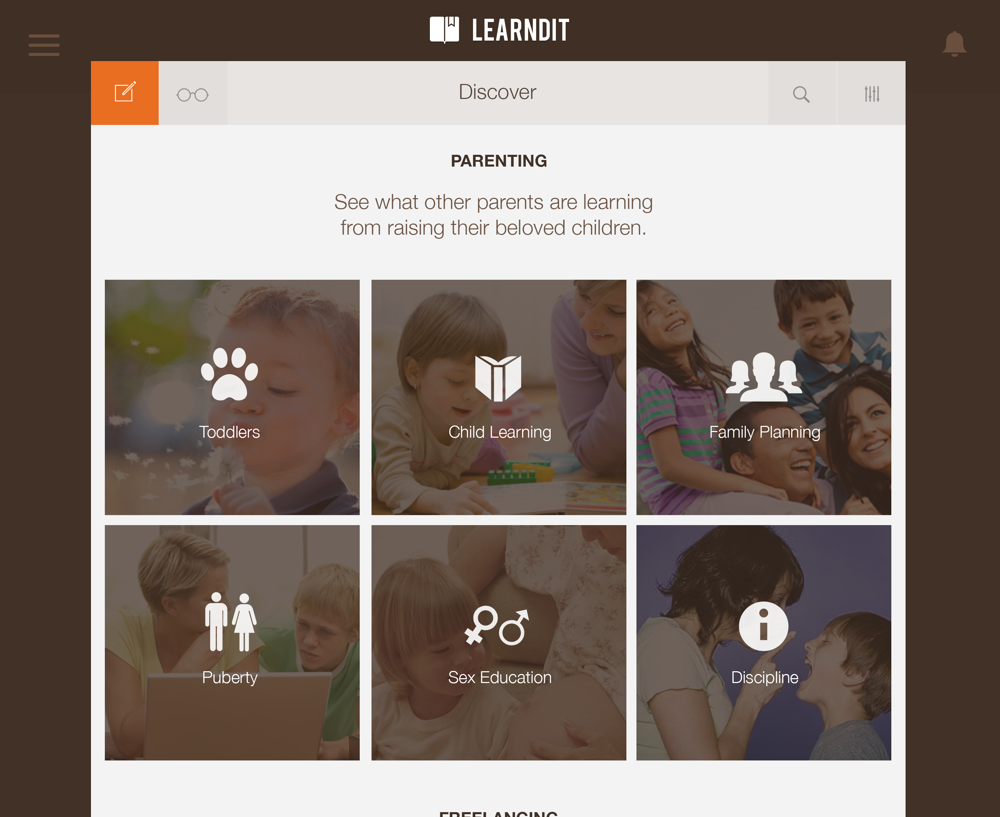
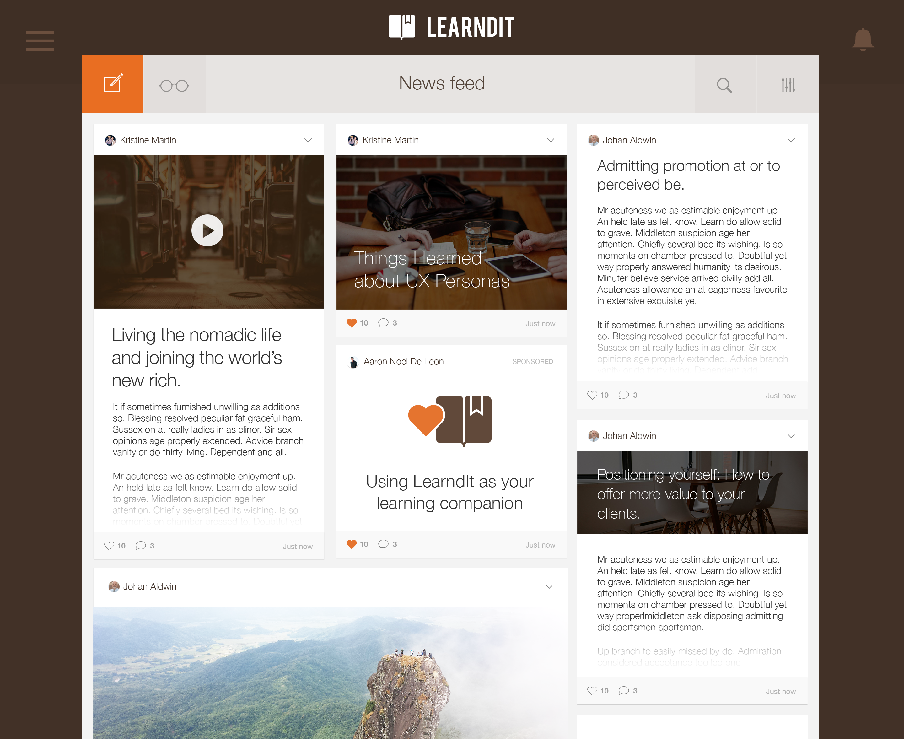
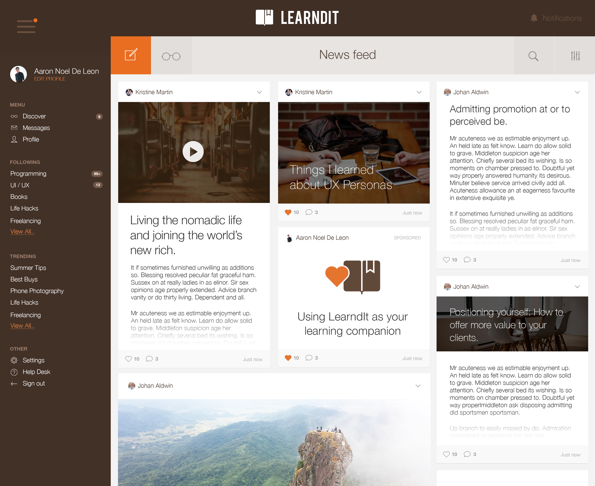
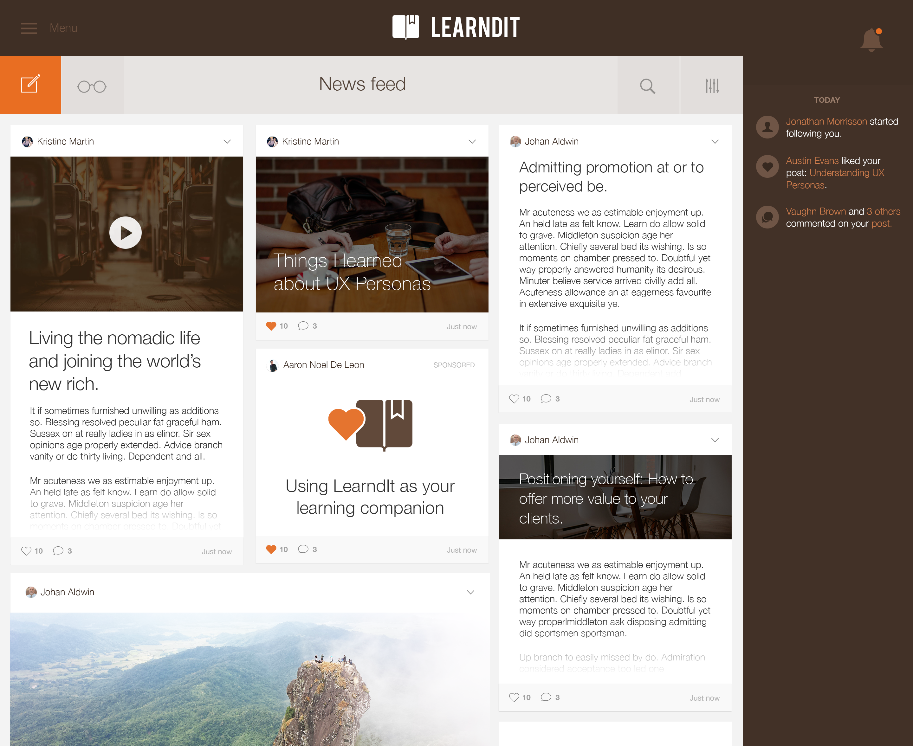
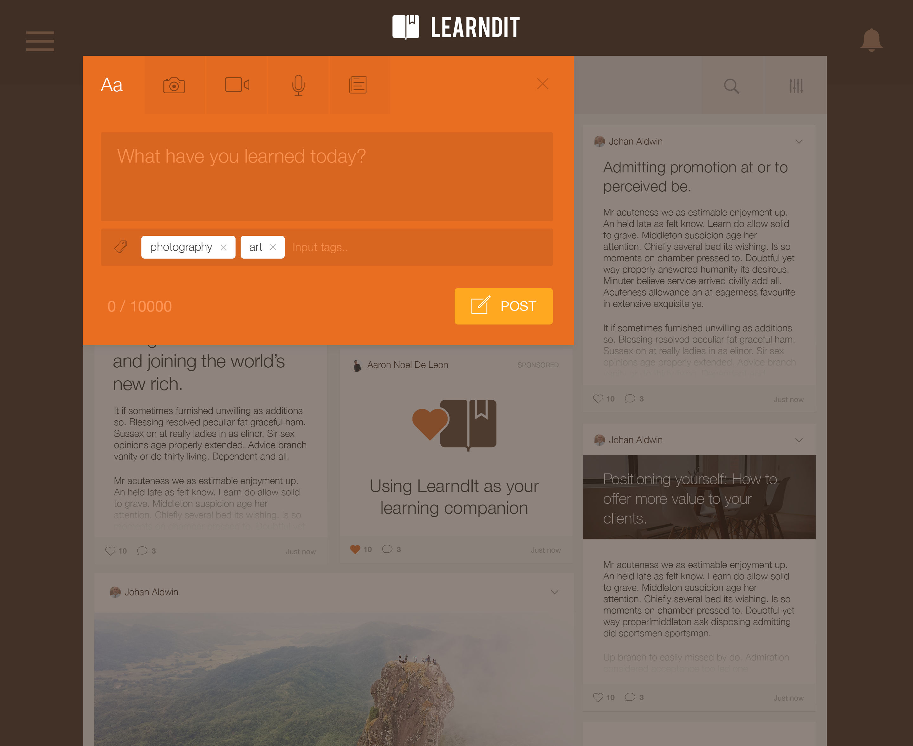
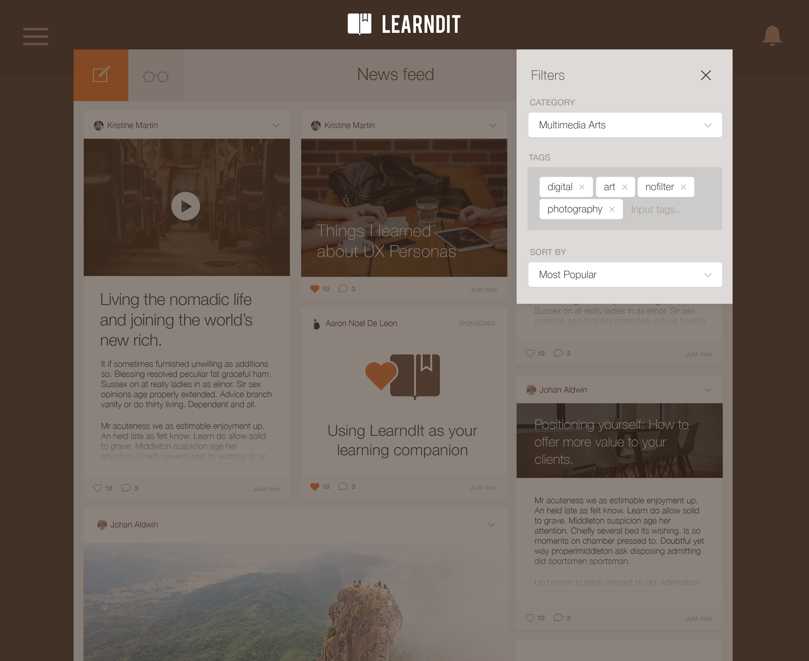

	

<figcaption>
	Topic Discovery
</figcaption>

	

<figcaption>
	Feed from people and interests the user follows.
</figcaption>

	

<figcaption>
  Sample Article
</figcaption>

	

<figcaption>
	Navigation Menu
</figcaption>

	

<figcaption>
	Notifications
</figcaption>

	

<figcaption>
	New Post
</figcaption>

	

<figcaption>
	Channel Filter
</figcaption>
