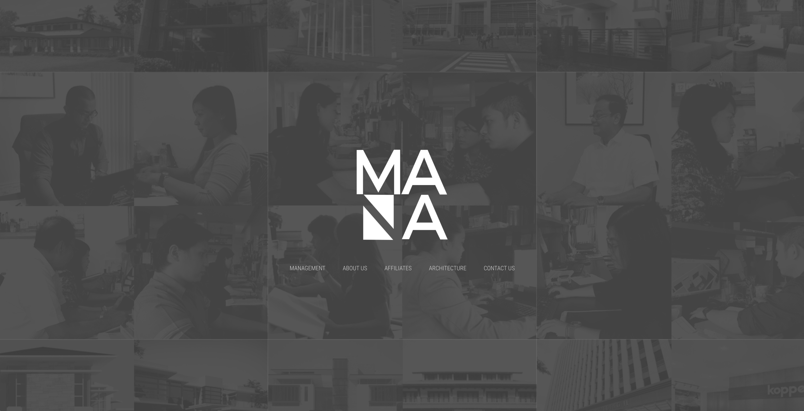
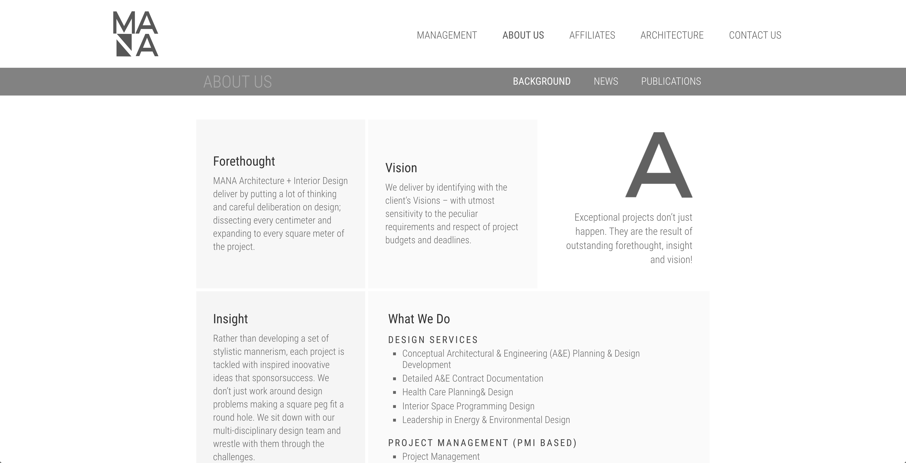
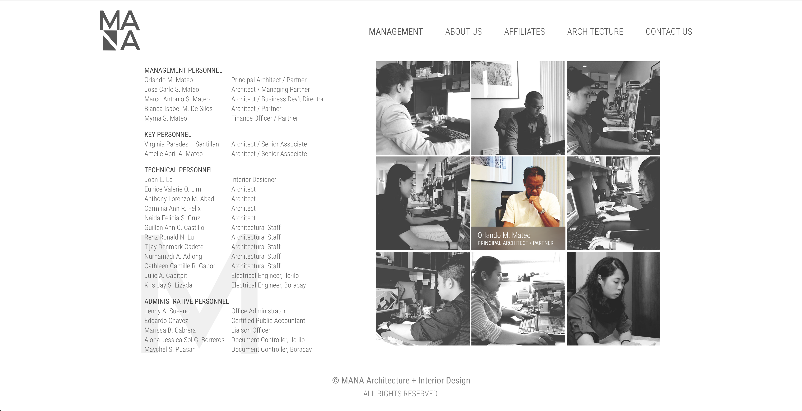
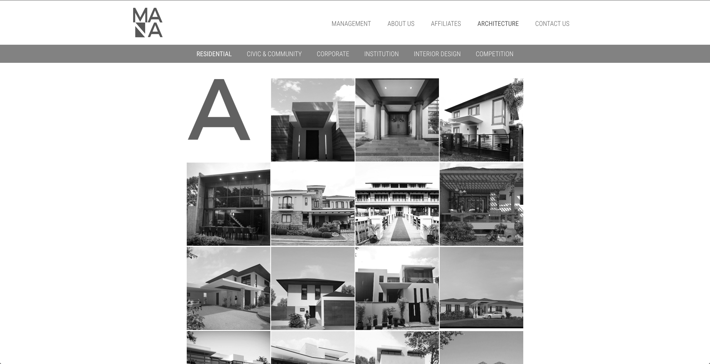
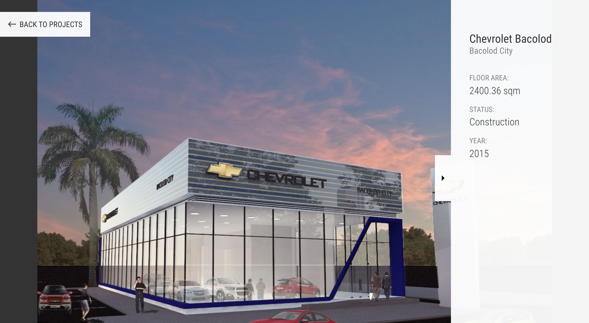
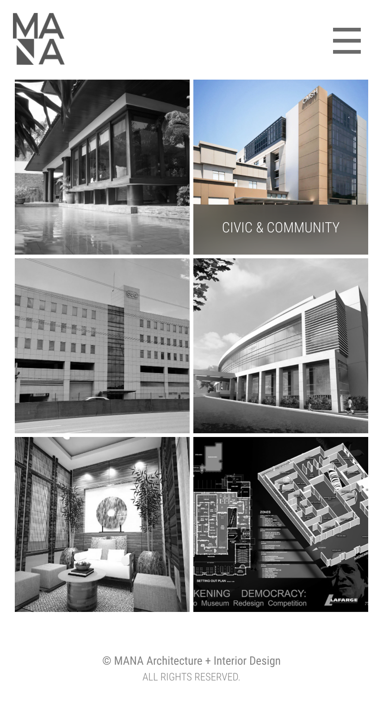
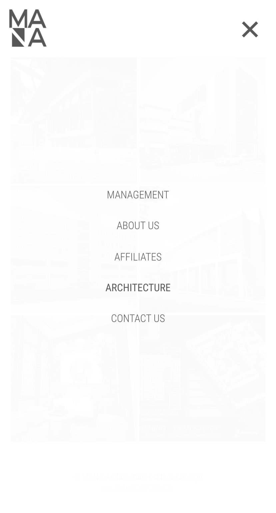

	

<figcaption>
	Landing page.
</figcaption>

	

	

	

<figcaption>
	Work gallery
</figcaption>

	

<figcaption>
	Image Preview
</figcaption>

	

		
	

	

		
	

	

		
	

<figcaption>
	Sample mobile screenshots
</figcaption>
