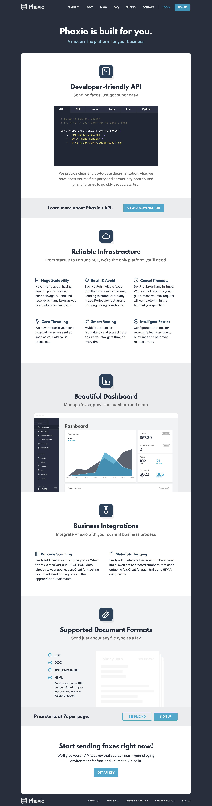
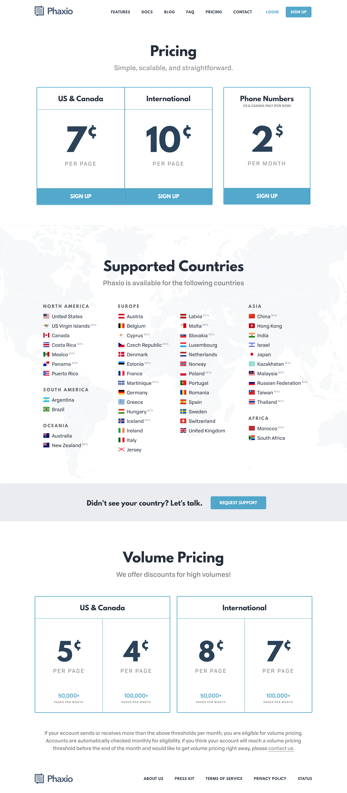
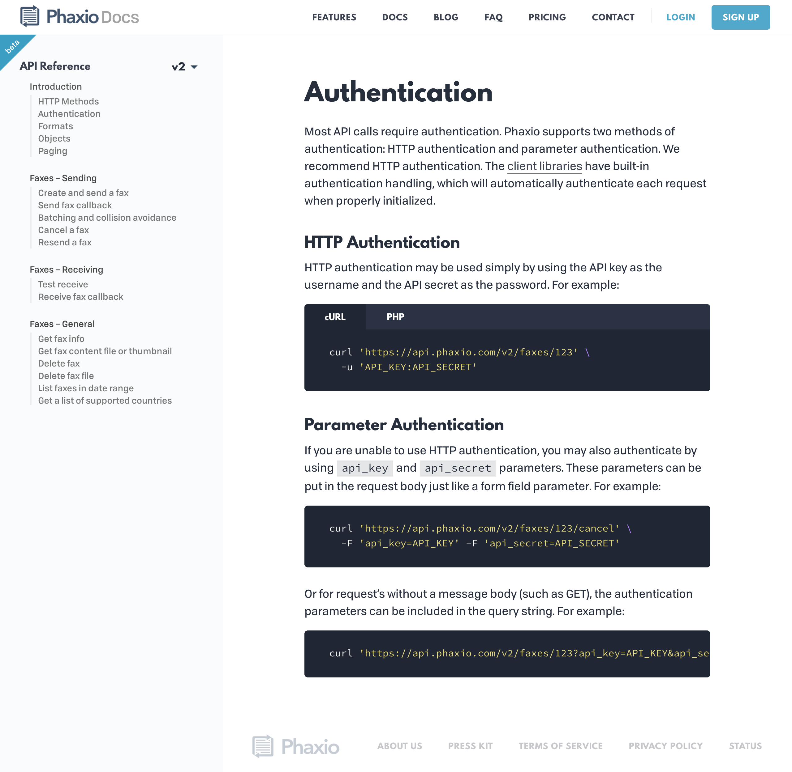
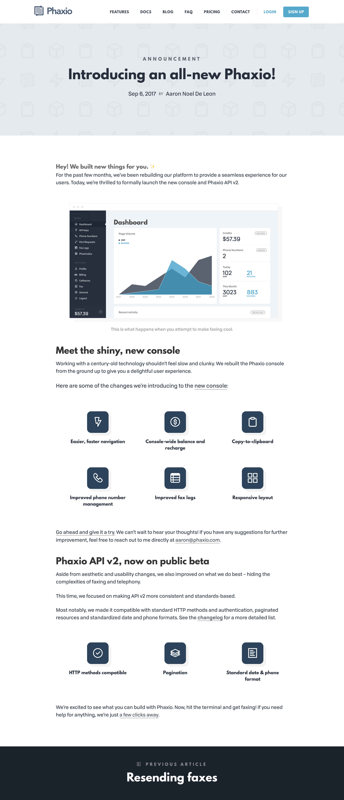
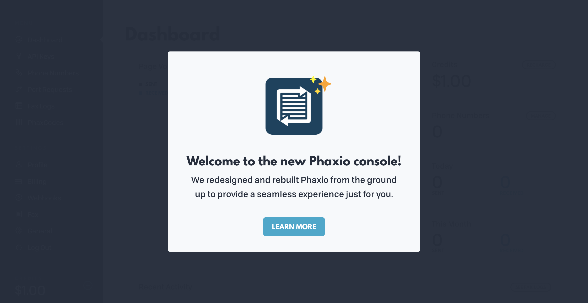
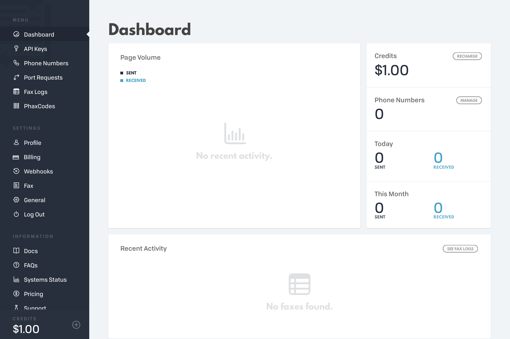
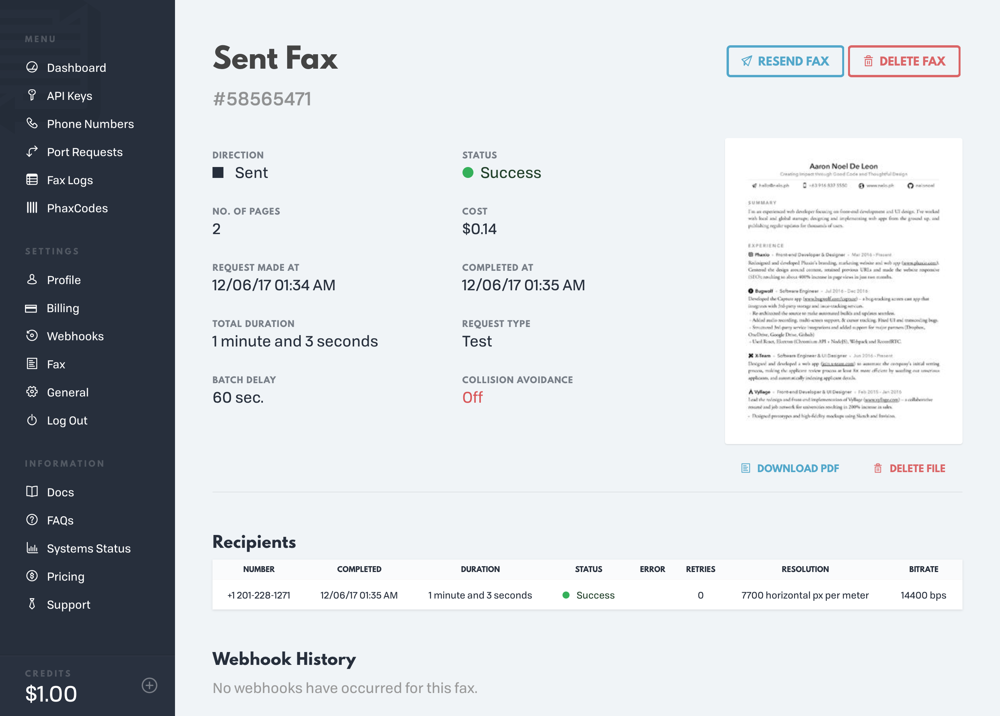

	

<figcaption>
	<strong>Landing Page</strong> – aims to decrease the friction for sign up; includes a sample code just below the fold and a sign up form towards the bottom with Twitter testimonials beside it.
</figcaption>

	

<figcaption>
	Product features page
</figcaption>

	

<figcaption>
	Pricing, international support, high-volume discounts.
</figcaption>

	

<figcaption>
	Documentation menu
</figcaption>

	

<figcaption>
	<strong>Sample documentation entry</strong> – featuring multi-language syntax highlighting.
</figcaption>

	

<figcaption>
	<strong>Blog posts</strong> – with original URLs from the previous version retained to build upon existing search engine rankings.
</figcaption>

	

<figcaption>
	<strong>Sample article</strong> – announcing the brand-new Phaxio console.
</figcaption>

	

<figcaption>
	User Onboarding
</figcaption>

	

<figcaption>
	<strong>Dashboard</strong> – featuring the <code>null</code> case.
</figcaption>

	

<figcaption>
	<strong>Billing form</strong> – sample form with all fieldsets expanded. Also, note the custom select box UI.
</figcaption>

	

<figcaption>
	Sample fax details page.
</figcaption>
