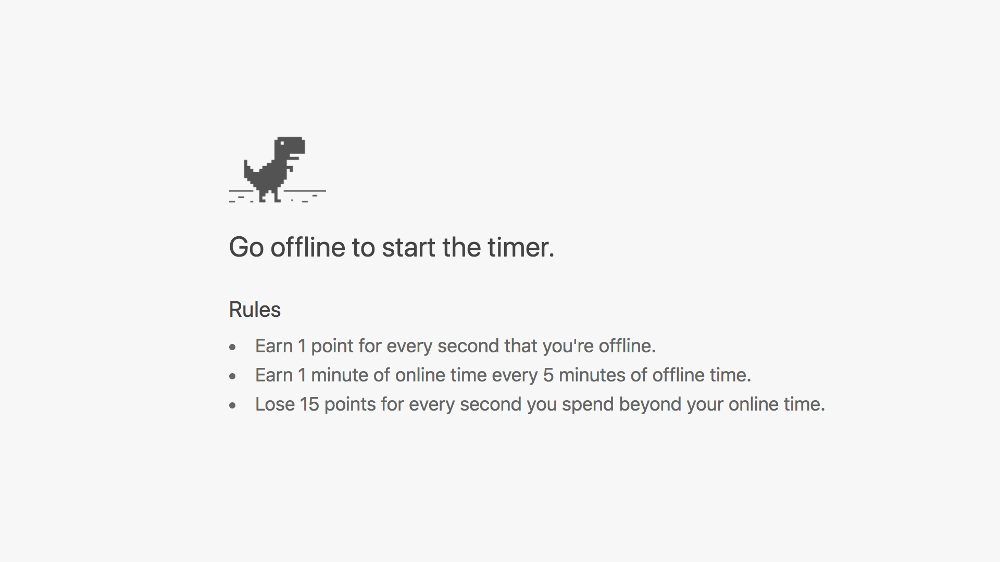
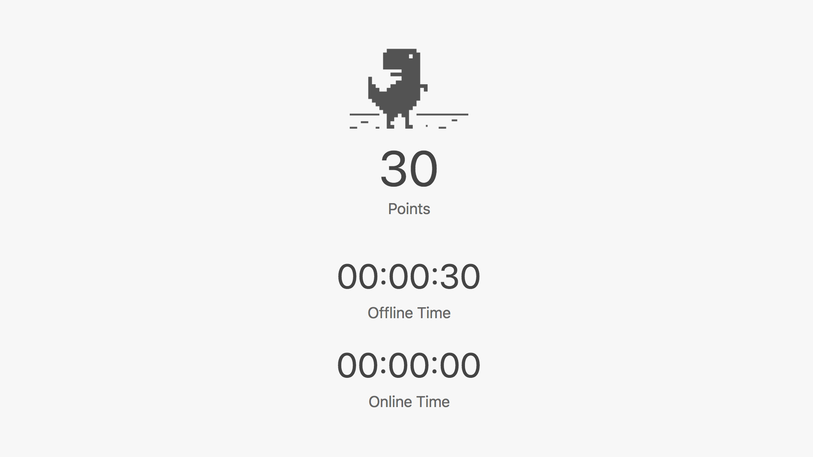

	

<figcaption>
	<strong>Landing page</strong> – was intentionally designed to look like Chrome's default offline page.
</figcaption>

	

<figcaption>
	<strong>Timer</strong> – shows up after disconnecting from the Internet.
</figcaption>
