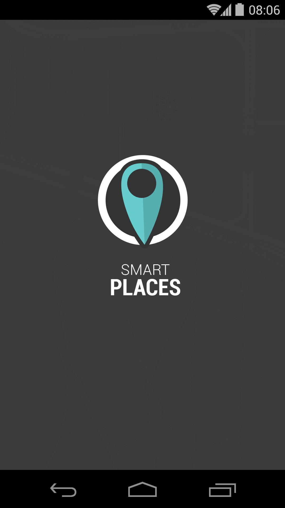
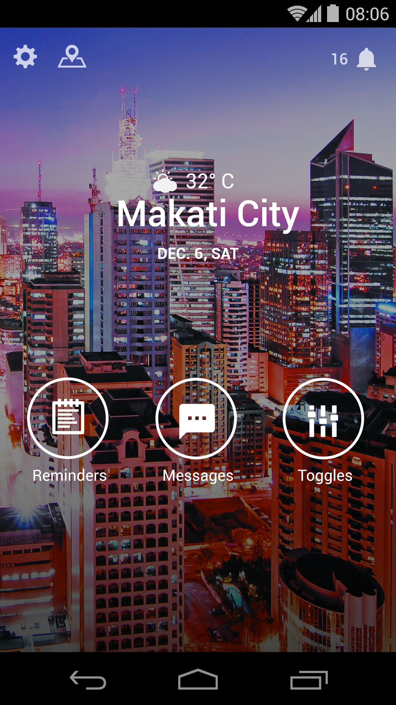
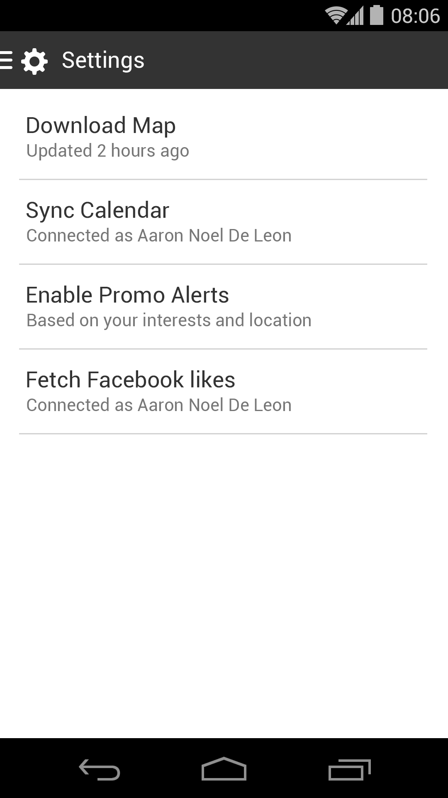
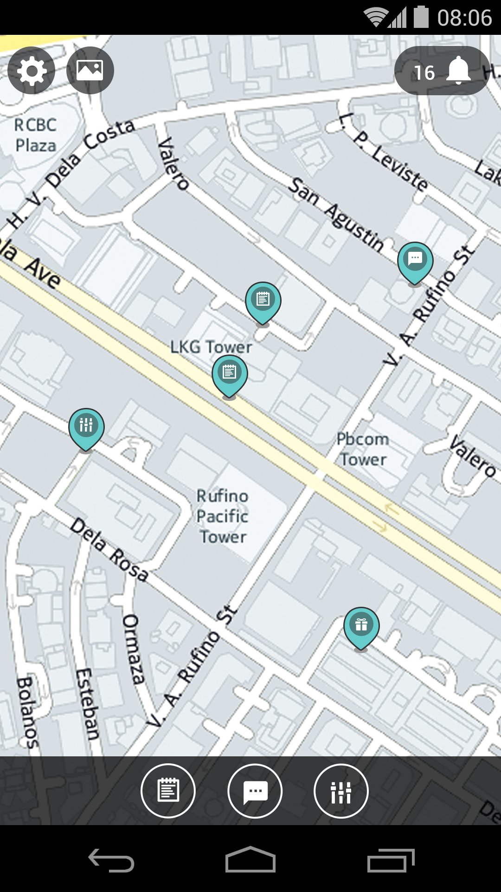
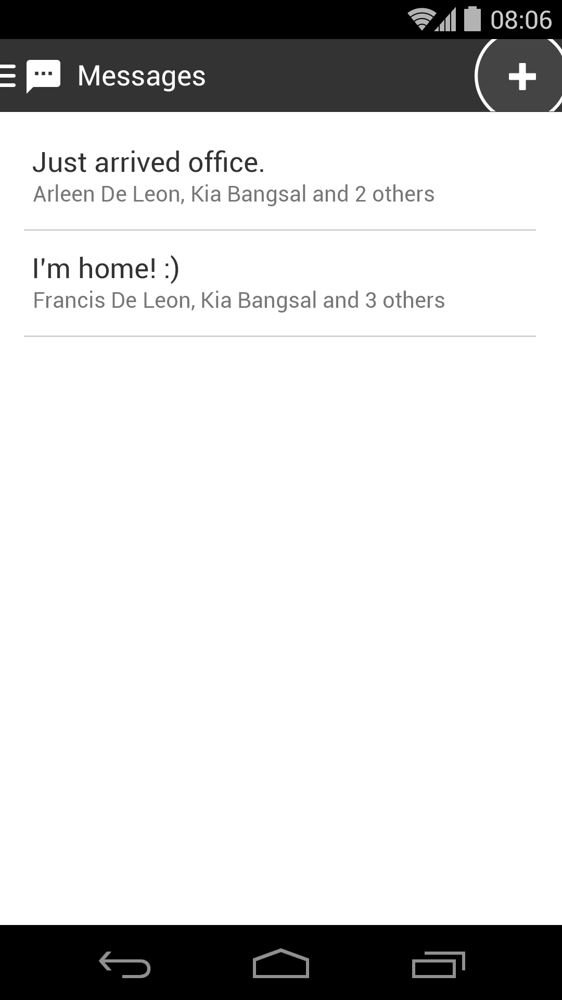
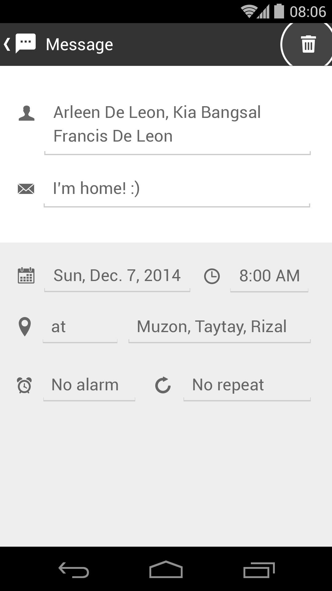
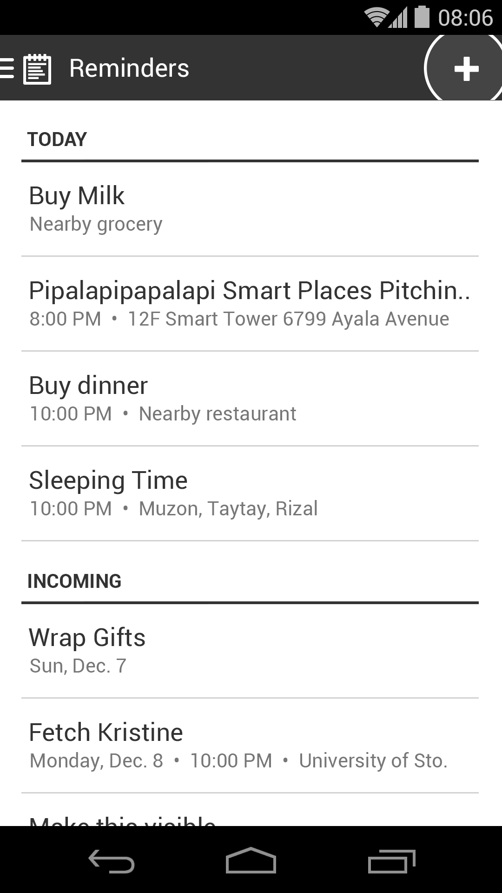
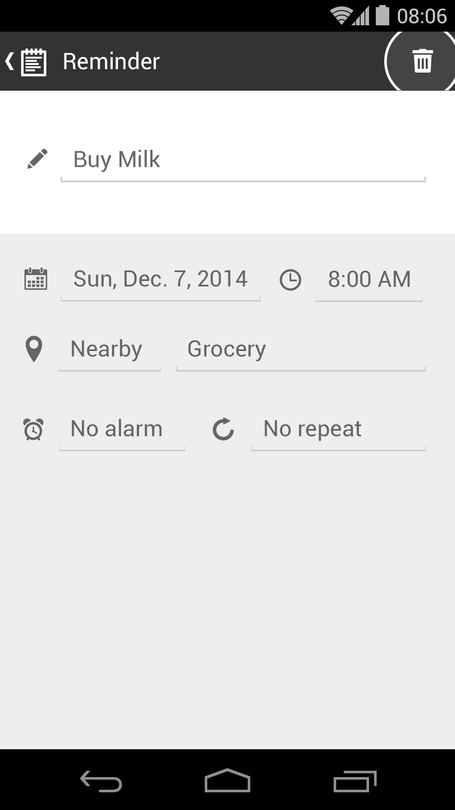
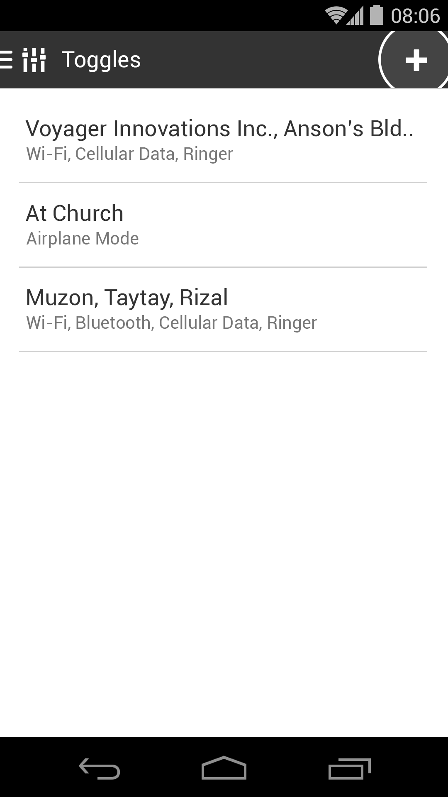
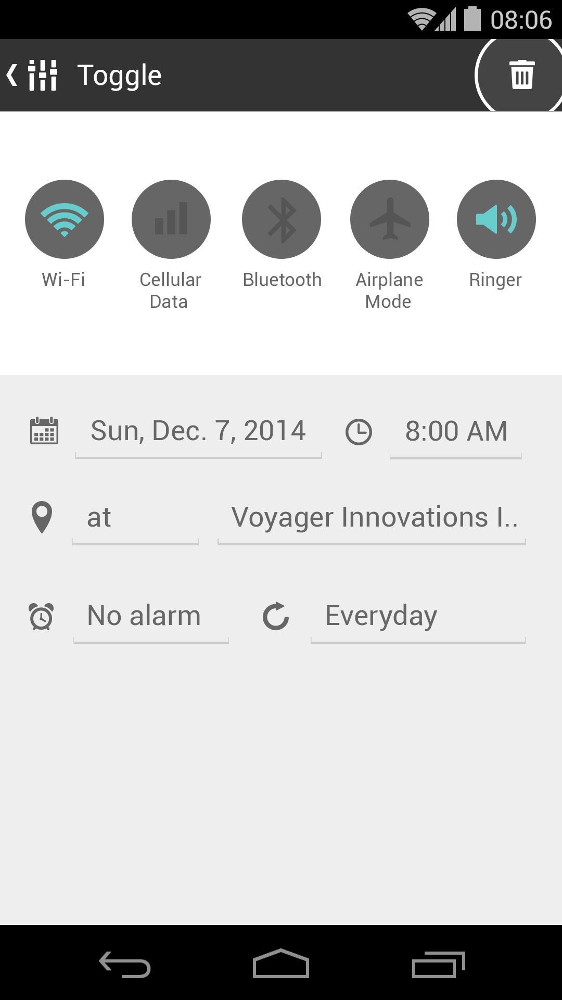

	

		<h6>Overview</h6>
		

			<strong>Smart Places</strong> is an Android app that executes actions based on the user's location.
		

		

			This app idea won 2nd runner up at Here Hackathon 2014.
		

	

	

		
	

	

		
	

	

		
	

	

		
	

	

		
	

<figcaption>
	A map view of all the user's automated messages, reminders, and device toggles.
</figcaption>

	

		<h6>Messages</h6>
		

			Send messages to your loved once you arrived a certain destination to let them know that you're safe.
		

	

	

		
	

	

		
	

	

		<h6>Reminders</h6>
		

			Set reminders the next time you're in a specific address or nearby an establishment type.
		

	

	

		
	

	

		
	

	

		<h6>Device Toggles</h6>
		

			Silence ringer in campus? Turn on WiFi in office?
		

		

			The app changes device settings automatically based on your location.
		

	

	

		
	

	

		
	

