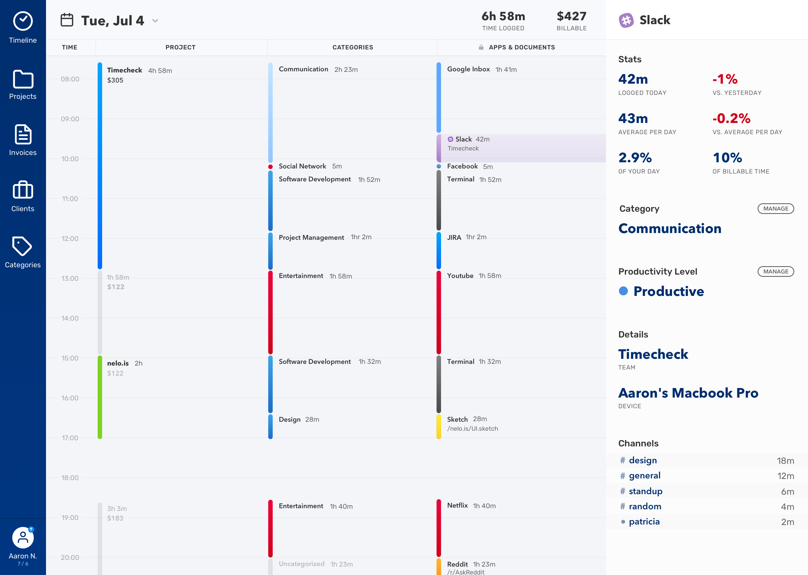
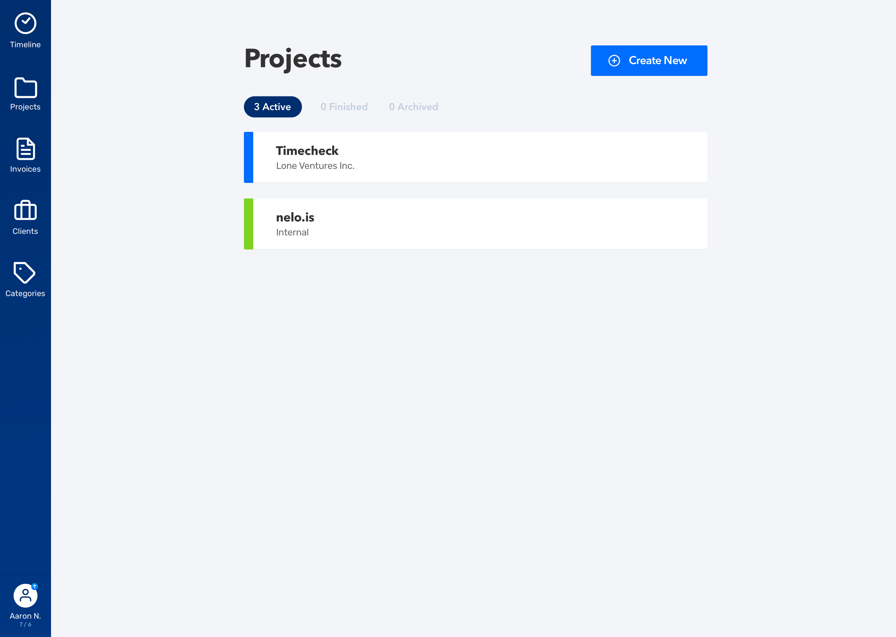

	

<figcaption>
	Timecheck's landing page.
</figcaption>

	

<figcaption>
	<strong>Timeline UI</strong> – aims to present a progressive amount of detail from left to right.
</figcaption>

	

<figcaption>
	<strong>Projects Page</strong> – categorizes time entries into buckets based on custom rules.
</figcaption>
