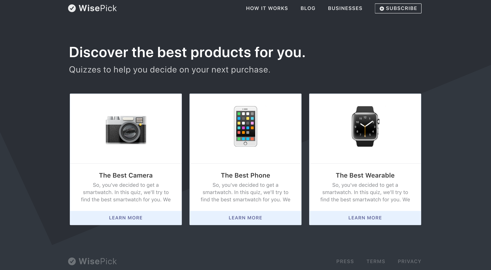
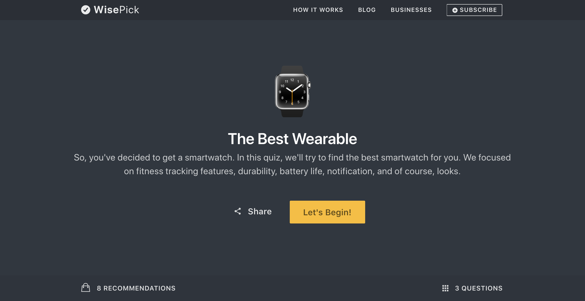
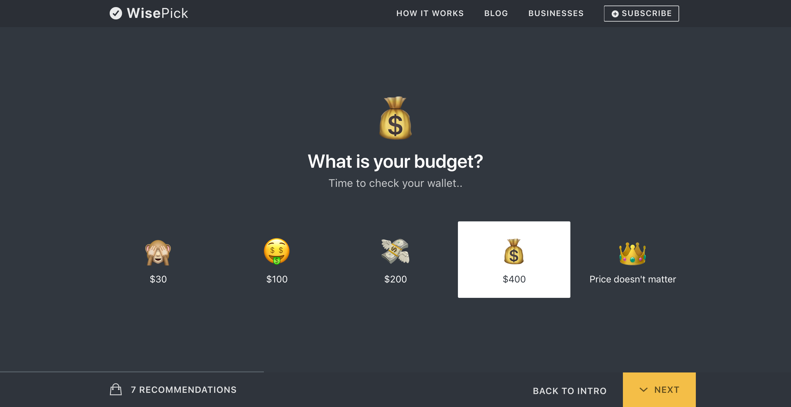
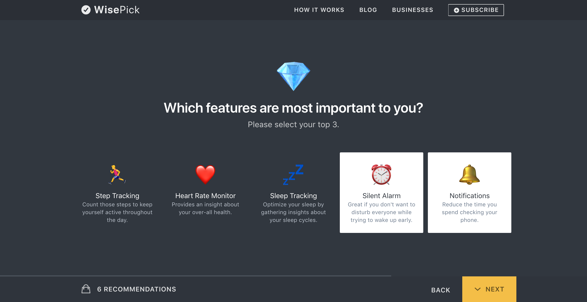
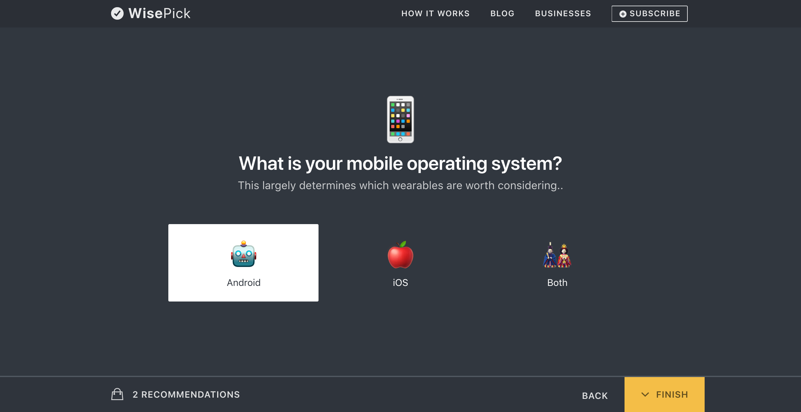
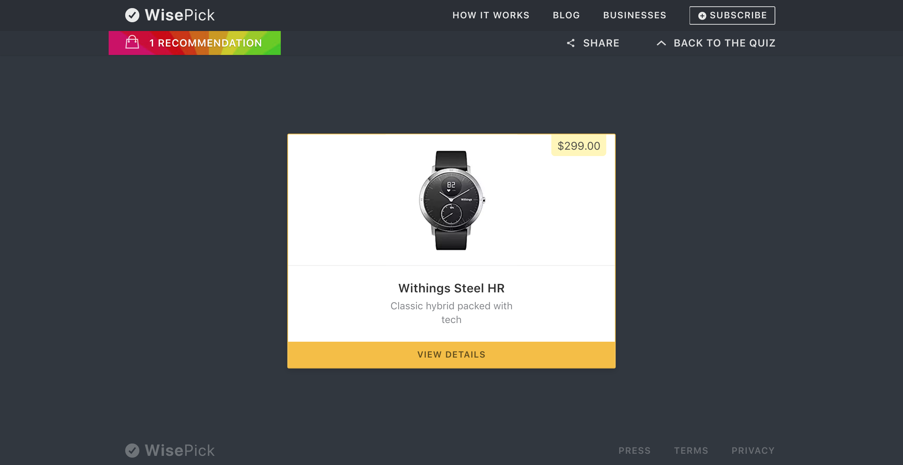

###### The Pitch

The best product out there might not be the best one for a very particular use case. WisePick aims to solve that by providing a good mix of objective and subjective product recommendations in the form of quizzes.

	

<figcaption>
	Product Selection Page
</figcaption>

	

<figcaption>
	A brief overview of how the quiz was structured.
</figcaption>

	

	

	

<figcaption>
	The recommendation pool can be checked at any point in the quiz. Also, it changes instantly to reflect the user's preferences.
</figcaption>

	

<figcaption>
	<strong>Unicorn product found!</strong>
	Shows up when there is exactly one product that matches the user's preferences.
</figcaption>
